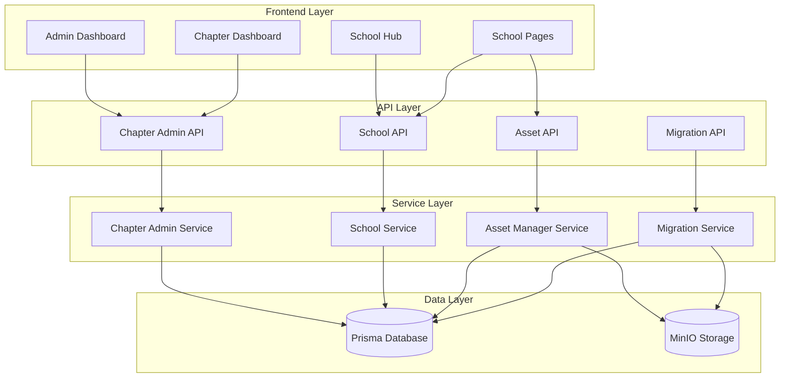
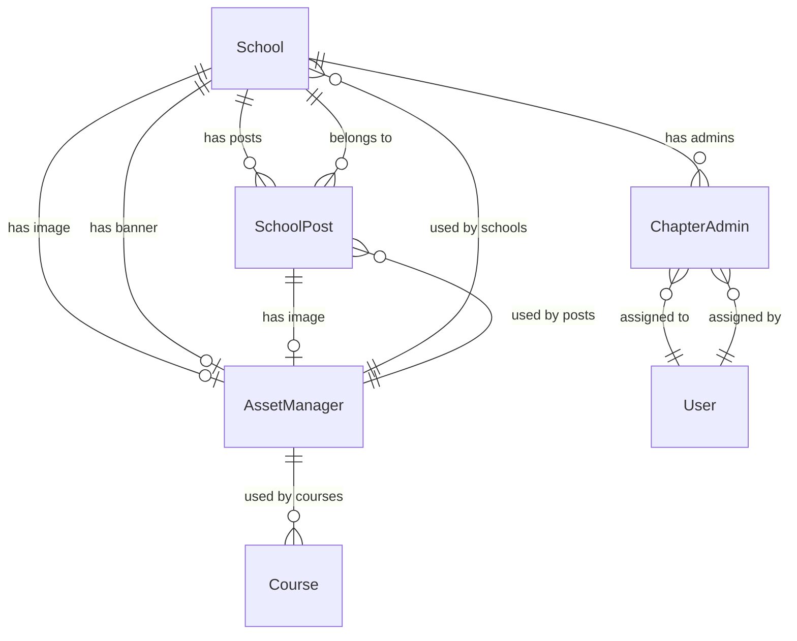

# Design Document

## Overview

This design document outlines the complete overhaul of the chapter admin system to address critical issues including "school not found" errors, broken admin assignments, and inconsistent data storage. The new system will be entirely database-driven using Prisma, implement a secure AssetManager for public assets, and provide a unified administrative experience.

The core architectural change moves from a hybrid MinIO JSON + database approach to a pure database-driven system with MinIO used exclusively for secure asset storage through a key-based AssetManager system.

## Architecture

### High-Level Architecture



### Data Flow Architecture

1. **Admin Assignment Flow**: Super Admin → API → Service → Database
2. **Asset Upload Flow**: User → Upload API → AssetManager → MinIO + Database
3. **Asset Retrieval Flow**: User → Asset API → Database Lookup → MinIO Retrieval
4. **School Data Flow**: Frontend → School API → Database Only

## Components and Interfaces

### Database Schema Extensions

#### AssetManager Model
```prisma
model AssetManager {
  id          String      @id @default(uuid())
  key         String      @unique  // Public-facing unique key
  fileName    String      // Original filename
  mimeType    String      // File MIME type
  fileSize    Int         // File size in bytes
  minioPath   String      // Internal MinIO path
  uploadedBy  String      // User ID who uploaded
  assetType   AssetType   // Type of asset
  isActive    Boolean     @default(true)
  createdAt   DateTime    @default(now())
  updatedAt   DateTime    @updatedAt
  
  // Relations to entities using this asset
  schoolImages    School[]     @relation("SchoolImageAsset")
  schoolBanners   School[]     @relation("SchoolBannerAsset") 
  postImages      SchoolPost[] @relation("PostImageAsset")
  courseImages    Course[]     @relation("CourseImageAsset")
  
  @@index([key])
  @@index([assetType])
  @@index([uploadedBy])
}

enum AssetType {
  SCHOOL_IMAGE
  SCHOOL_BANNER
  POST_IMAGE
  COURSE_IMAGE
  CHAPTER_VIDEO
  NOTE_ATTACHMENT
}
```

#### ChapterAdmin Model
```prisma
model ChapterAdmin {
  id          String              @id @default(uuid())
  userId      String              // Clerk user ID
  schoolId    String
  school      School              @relation(fields: [schoolId], references: [id], onDelete: Cascade)
  role        ChapterAdminRole    @default(CHAPTER_ADMIN)
  assignedBy  String              // User ID who assigned this role
  isActive    Boolean             @default(true)
  createdAt   DateTime            @default(now())
  updatedAt   DateTime            @updatedAt
  
  @@unique([userId, schoolId])
  @@index([userId])
  @@index([schoolId])
  @@index([role])
}

enum ChapterAdminRole {
  CHAPTER_ADMIN
  CHAPTER_SUPER_ADMIN
}
```

#### Updated School Model
```prisma
model School {
  id             String        @id @default(uuid())
  name           String
  description    String?       @db.Text
  location       String?
  website        String?
  email          String?
  phone          String?
  isActive       Boolean       @default(true)
  volunteerHours Int           @default(0)
  activeMembers  Int           @default(0)
  createdAt      DateTime      @default(now())
  updatedAt      DateTime      @updatedAt
  createdBy      String
  
  // Asset references
  imageAssetKey    String?
  bannerAssetKey   String?
  imageAsset       AssetManager? @relation("SchoolImageAsset", fields: [imageAssetKey], references: [key])
  bannerAsset      AssetManager? @relation("SchoolBannerAsset", fields: [bannerAssetKey], references: [key])
  
  // Relations
  posts          SchoolPost[]
  chapterAdmins  ChapterAdmin[]
  
  @@index([isActive])
  @@index([createdAt])
  @@index([volunteerHours])
}
```

### API Endpoints Design

#### Chapter Admin Management
```typescript
// GET /api/chapter-admins
interface GetChapterAdminsResponse {
  admins: ChapterAdmin[]
  total: number
}

// POST /api/chapter-admins
interface AssignChapterAdminRequest {
  schoolId: string
  targetUserId: string
  role: 'CHAPTER_ADMIN' | 'CHAPTER_SUPER_ADMIN'
}

// DELETE /api/chapter-admins/[id]
interface RemoveChapterAdminResponse {
  success: boolean
  message: string
}
```

#### Asset Management
```typescript
// POST /api/assets/upload
interface AssetUploadRequest {
  file: File
  assetType: AssetType
}

interface AssetUploadResponse {
  key: string
  url: string // API endpoint URL
}

// GET /api/assets/[key]
// Returns the actual file with appropriate headers
```

#### School Management
```typescript
// GET /api/schools
interface GetSchoolsResponse {
  schools: School[]
  total: number
}

// POST /api/schools
interface CreateSchoolRequest {
  name: string
  description?: string
  location?: string
  website?: string
  email?: string
  phone?: string
  imageAssetKey?: string
  bannerAssetKey?: string
}
```

### Service Layer Components

#### ChapterAdminService
```typescript
class ChapterAdminService {
  async assignAdmin(request: AssignChapterAdminRequest): Promise<ChapterAdmin>
  async removeAdmin(adminId: string): Promise<void>
  async getAdminsBySchool(schoolId: string): Promise<ChapterAdmin[]>
  async getSchoolsByUser(userId: string): Promise<ChapterAdmin[]>
  async hasPermission(userId: string, schoolId: string, requiredRole?: ChapterAdminRole): Promise<boolean>
  async validateSchoolExists(schoolId: string): Promise<boolean>
}
```

#### AssetManagerService
```typescript
class AssetManagerService {
  async uploadAsset(file: File, assetType: AssetType, uploadedBy: string): Promise<AssetManager>
  async getAsset(key: string): Promise<{ stream: ReadableStream, mimeType: string, fileName: string }>
  async deleteAsset(key: string): Promise<void>
  async migrateExistingAssets(): Promise<void>
  private generateUniqueKey(): string
  private getMinioPath(assetType: AssetType): string
}
```

#### SchoolService
```typescript
class SchoolService {
  async getAllSchools(): Promise<School[]>
  async getSchoolById(id: string): Promise<School | null>
  async createSchool(data: CreateSchoolRequest): Promise<School>
  async updateSchool(id: string, data: Partial<School>): Promise<School>
  async deleteSchool(id: string): Promise<void>
  async updateSchoolStats(id: string, stats: { volunteerHours?: number, activeMembers?: number }): Promise<School>
}
```

## Data Models

### Core Data Relationships



### Permission Matrix

| Role | Create Schools | Delete Schools | Assign Super Admins | Assign Admins | Edit Volunteer Hours | Edit Active Members | Create Posts |
|------|----------------|----------------|---------------------|---------------|---------------------|-------------------|--------------|
| Super Admin | ✅ | ✅ | ✅ | ✅ | ✅ | ✅ | ✅ |
| Chapter Super Admin | ❌ | ❌ | ❌ | ✅ | ✅ | ✅ | ✅ |
| Chapter Admin | ❌ | ❌ | ❌ | ❌ | ❌ | ✅ | ✅ |
| Regular User | ❌ | ❌ | ❌ | ❌ | ❌ | ❌ | ❌ |

## Error Handling

### Error Types and Responses

```typescript
enum ErrorCode {
  SCHOOL_NOT_FOUND = 'SCHOOL_NOT_FOUND',
  INSUFFICIENT_PERMISSIONS = 'INSUFFICIENT_PERMISSIONS',
  ASSET_NOT_FOUND = 'ASSET_NOT_FOUND',
  INVALID_ASSET_KEY = 'INVALID_ASSET_KEY',
  ADMIN_ALREADY_EXISTS = 'ADMIN_ALREADY_EXISTS',
  MIGRATION_FAILED = 'MIGRATION_FAILED'
}

interface ApiError {
  code: ErrorCode
  message: string
  details?: any
}
```

### Error Handling Strategy

1. **Validation Errors**: Return 400 with detailed field errors
2. **Permission Errors**: Return 403 with clear permission requirements
3. **Not Found Errors**: Return 404 with resource type and ID
4. **Server Errors**: Return 500 with error ID for tracking
5. **Asset Errors**: Return appropriate status with asset-specific messages

## Testing Strategy

### Unit Testing
- **Service Layer**: Test all business logic with mocked dependencies
- **API Endpoints**: Test request/response handling and validation
- **Database Operations**: Test Prisma queries with test database
- **Asset Management**: Test file upload/download operations

### Integration Testing
- **End-to-End Admin Assignment**: Test complete admin assignment flow
- **Asset Upload/Retrieval**: Test complete asset lifecycle
- **Permission Checking**: Test role-based access control
- **Migration Process**: Test data migration from MinIO to database

### Test Data Setup
```typescript
// Test fixtures for consistent testing
const testSchool = {
  name: "Test School",
  description: "A test school",
  location: "Test City",
  isActive: true
}

const testAdmin = {
  userId: "test-user-id",
  role: ChapterAdminRole.CHAPTER_ADMIN,
  assignedBy: "super-admin-id"
}
```

## Security Considerations

### Asset Security
1. **Key-Based Access**: All assets accessed through unique, non-guessable keys
2. **No Path Exposure**: MinIO paths never exposed to frontend
3. **Access Control**: Asset access controlled through database permissions
4. **IDOR Prevention**: Keys prevent direct object reference attacks

### Permission Security
1. **Role Validation**: All operations validate user roles
2. **School Association**: Admins can only manage assigned schools
3. **Audit Logging**: All admin actions logged for accountability
4. **Session Management**: Proper authentication required for all operations

### Data Security
1. **Input Validation**: All inputs validated using Zod schemas
2. **SQL Injection Prevention**: Prisma ORM prevents SQL injection
3. **XSS Prevention**: All user content properly escaped
4. **CSRF Protection**: API endpoints protected against CSRF

## Performance Optimizations

### Database Optimizations
1. **Indexing Strategy**: Proper indexes on frequently queried fields
2. **Query Optimization**: Use Prisma's include/select for efficient queries
3. **Connection Pooling**: Proper database connection management
4. **Caching Strategy**: Redis caching for frequently accessed data

### Asset Delivery Optimizations
1. **CDN Integration**: Consider CDN for asset delivery
2. **Caching Headers**: Proper cache headers for static assets
3. **Compression**: Gzip compression for text-based assets
4. **Lazy Loading**: Load assets only when needed

### API Performance
1. **Pagination**: Implement pagination for large datasets
2. **Rate Limiting**: Prevent API abuse
3. **Response Compression**: Compress API responses
4. **Efficient Serialization**: Optimize JSON serialization

## Migration Strategy

### Phase 1: Database Schema Updates
1. Create AssetManager model
2. Create ChapterAdmin model
3. Update School model with asset references
4. Run database migrations

### Phase 2: Asset Migration
1. Identify all existing assets in MinIO
2. Create AssetManager records for existing assets
3. Update database references to use asset keys
4. Validate migration success

### Phase 3: Admin System Migration
1. Migrate existing MinIO admin data to database
2. Update API endpoints to use database
3. Update frontend to use new endpoints
4. Remove MinIO admin dependencies

### Phase 4: Cleanup and Validation
1. Remove unused MinIO admin files
2. Validate all functionality works
3. Update documentation
4. Deploy to production

## Monitoring and Observability

### Metrics to Track
1. **Admin Assignment Success Rate**: Track successful vs failed assignments
2. **Asset Upload/Download Performance**: Monitor asset operation times
3. **Database Query Performance**: Track slow queries
4. **Error Rates**: Monitor API error rates by endpoint

### Logging Strategy
1. **Structured Logging**: Use structured logs for better parsing
2. **Admin Actions**: Log all admin assignments/removals
3. **Asset Operations**: Log asset uploads/downloads/deletions
4. **Performance Logs**: Log slow operations for optimization

### Health Checks
1. **Database Connectivity**: Verify database connection
2. **MinIO Connectivity**: Verify MinIO connection
3. **Asset Integrity**: Periodic checks for orphaned assets
4. **Admin Data Consistency**: Verify admin assignments are valid

## Deployment Considerations

### Environment Variables
```env
# Database
DATABASE_URL=postgresql://...
DIRECT_URL=postgresql://...

# MinIO
MINIO_URL=http://localhost:9000
MINIO_ACCESS_KEY=...
MINIO_SECRET_KEY=...
MINIO_BUCKET_NAME=cambright-assets

# Asset Management
ASSET_BASE_URL=https://api.cambright.com/api/assets
ASSET_CACHE_TTL=3600
```

### Docker Configuration
- Ensure MinIO is accessible from application container
- Configure proper networking between services
- Set up health checks for all services
- Configure proper resource limits

### Production Considerations
1. **Database Backups**: Regular automated backups
2. **Asset Backups**: MinIO backup strategy
3. **Monitoring**: Comprehensive monitoring setup
4. **Scaling**: Consider read replicas for database
5. **Security**: Proper firewall and access controls